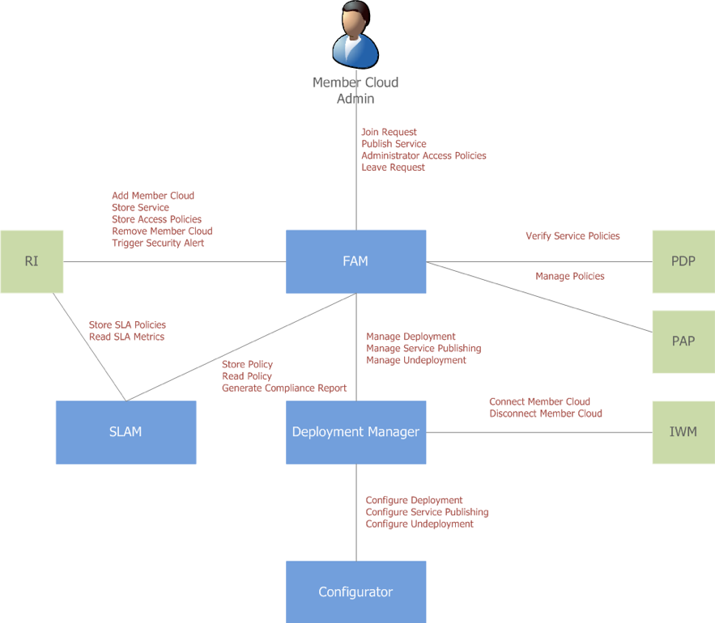
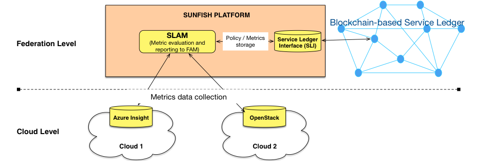
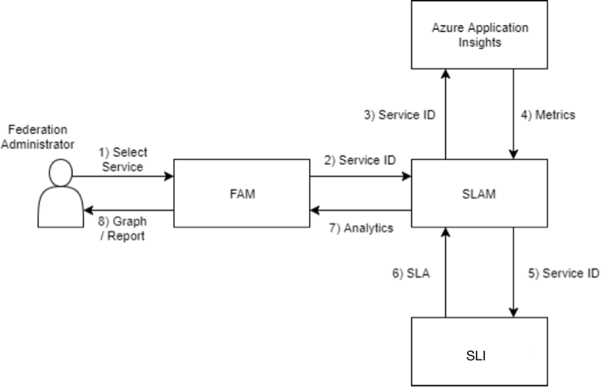
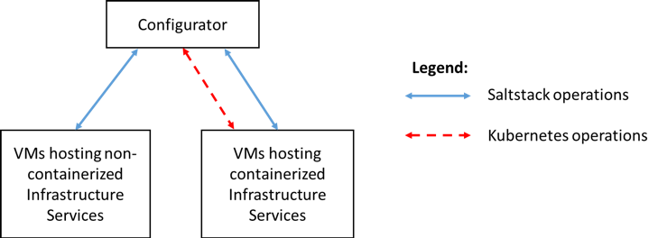

######################################################
Federated Administration and Monitoring (FAM)
######################################################

The Federated Administration and Monitoring (FAM) component is the management plane of the SUNFISH FaaS federation. It provides federation administrators with a graphical interface to configure, manage and monitor the services that are made available to the federation. The FAM captures the information submitted by the administrators, validates it, and dispatches that information to the respective low-level sub-components.

The FAM provides administrators with a set of functions such as to join and leave the federation, publish services and administrator access policies. It then relies on other SUNFISH components to execute the low-level instructions. The FAM has 3 sub-components being the Deployment Manager, Configurator and SLA Manager as depicted below. 

The high-level interactions orchestrated by the FAM to federate a new member cloud (Cloud Federation phase, see :ref:`faas-label` ) and to make an already federated member cloud leave the federation (Federation Leaving phase, see :ref:`faas-label` ). The logic to coordinate these operations is encapsulated in the Deployment Manager component, which instructs the Configurator and consequently the IWM to execute the required actions.

Thus, the flow of interactions for the Cloud Federation phase can be summarised as follows

*	The FAM asks the Deployment Manager to federate a new member cloud.
*	The Deployment Manager instructs the IWM Adapter to establish a connection to such member cloud.
*	The IWM  interacts with this member cloud at the infrastructure level to install the software required to make it configurable for the next step.
*	The Configurator deploys required SUNFISH components over the resources provided by the new member cloud, according to a deployment plan decided by the Deployment Manager.

Similarly, for the Federation Leaving phase, the high-level sequence of interactions is as follows

*	The FAM asks the Deployment Manager to make an already federated member cloud leave the federation.
*	The Deployment Manager commands the Configurator to un-deploy all the SUNFISH components currently placed on the resources provided by the member cloud.
*	The Configurator applies such un-deployment and thus removes all the SUNFISH software currently installed on the member cloud.
*	Then the Deployment Manager asks the IWM Adapter to remove all the software that were installed during the Cloud Federation phase to establish the initial connection.

=======================================
Service Level Agreement Manager (SLAM)
=======================================

The Service Level Agreement Manager (SLAM) unit provides management of service level agreements (SLAs) and metrics for services within the federation. Administrators are able to monitor these services on the FAM graphical user interface via data representation graphs composed from the analytics provided by the SLAM. The use of SLAs identifies which services are not fulfilling the set requirements and notifies administrators about such services.

To realise the SLAM, we rely on products already available to realise SLA monitoring and adopt the SLALOM metrics specialised to the context of the Public Sector. The realised component is integrated with the SLA service Insight of Microsoft Azure (see the code `here <https://github.com/sunfish-prj/SLA-Manager>`_). 

SLAs are used for analytics reports on services registered within the federation. Below is shown a detailed workflow between the FAM, SLAM and SLI components to construct and view analytical reports to federation administrators

The reported workflow can be described as follows

1.	Federation administrator selects service via graphical user interface on the FAM.
2.	The FAM sends the service ID along with query parameters to the SLAM and requests data analytics of the service.
3.	The SLAM sends the service ID to Azure Application Insights and requests metrics for the service.
4.	Azure Application Insights returns all available metrics for the given criteria.
5.	The SLAM sends the service ID to the Service Ledger Interface and requests the service's SLA.
6.	The Service Ledger Interface returns the SLA for the respective service.
7.	Data analytics are sent back to the FAM.
8.	The FAM builds the analytics into visual data representation.

==================================
Configurator & Deployment Manager
==================================

The Configurator component consists in a set of Infrastructure Services actuating commands and controls relative to the deployment and configurations of other Infrastructure Services. 

While the Configurator has not a decision-making role on the Deployment State of a federation, it provides APIs for its actuation, and for the retrieving of information sufficient for its determination. The Configurator provides the following functionalities:

*	Automatic configuration of the VMs hosting non-containerised Infrastructure Services 
*	Automatic deployment and managing of the containerised Infrastructure Services among Nodes of a cluster

The Configurator relies on the following technologies:

*	Configuration Management Engine: a software responsible of ensuring that a remote operating system is configured in terms of installed packages, presence of files and services. The solution utilised is Saltstack.
*	Container: it represents an isolated, resource-controlled, portable operating environment where an application can be deployed. The solution utilised is Docker. Container Cluster Manager: it represents a software capable of orchestrating Containers among a set of nodes. The solution utilised is Kubernetes.

The functionality is therefore carried out according to the following logical connection

The Deployment Manager, properly instructed by the FAM, is utilised to properly instruct the configurator. Therefore, according to the current global state the Deployment Manager takes a decision on how to modify and set up a specific service via the Configurator. 

