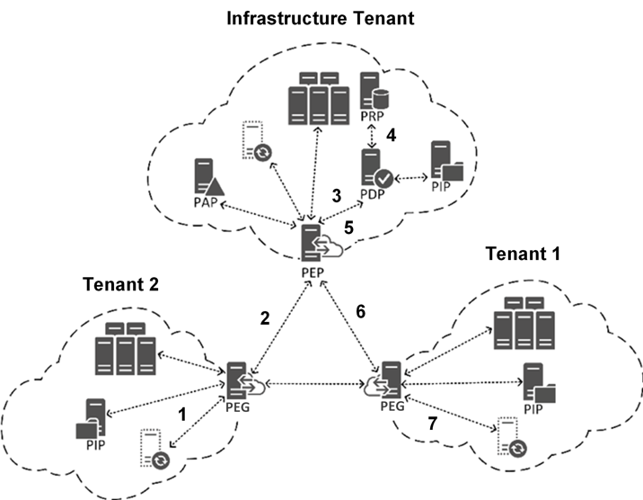
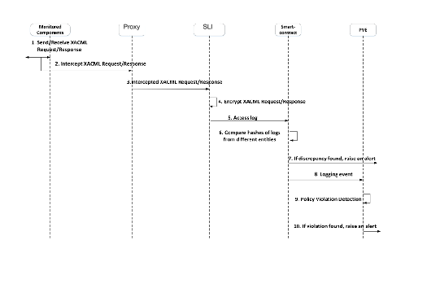
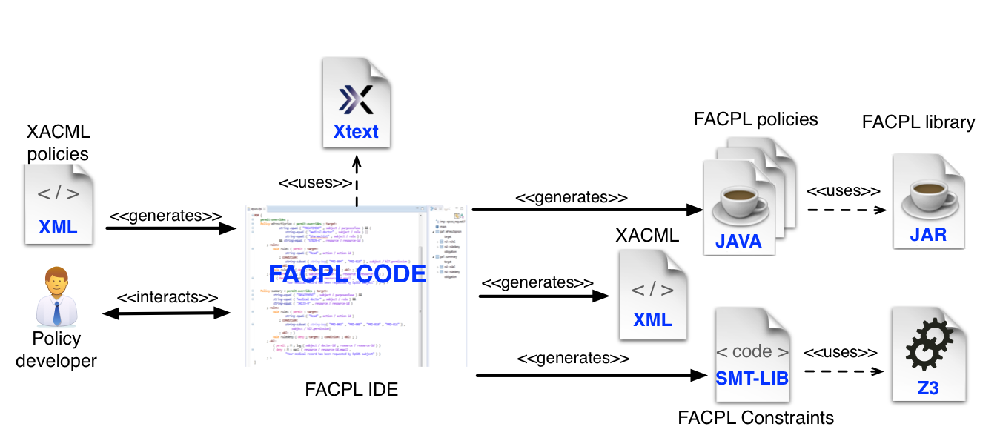

####################################
Federated Runtime Monitoring (FRM)
####################################

FRM (Federated Runtime Monitoring) consists of the following components: 

* *Proxy*: it monitors the interactions among the DS components, providing the access log upon which the monitoring service is built;
* *Chaincode*: it is the blockchain smart contract checking that no access decision has been subverted due to hijacking of intermediate DS components (aka PEGs and PIPs see :ref:`ds-label`); 
* *Policy Violation Engine*: it is the component based on the formal language `FACPL <http://facpl.sf.net>`_ checking that the PDP (see :ref:`ds-label`) has not been compromised and hence access control policy circumvented. 

The functionality of the components are discussed below. 

Proxy
===========

The DS components architecture (:ref:`ds-label`) is based on a Tomcat server solution (:ref:`ds-infr-label`), where Policy Enforcement Points (PEP) mediate access among tenants and services. Actually, PEPs enforce decision calculated by the Policy Decision Point (PDP) which relies (via other DS components here not listed for the sake of presentation) on the Service Ledger to retrieve the policy in force in the federation for a given access request. 

The monitoring algorithm implemented via the chaincode requires the requests transmitted across tenants---hence exchanged between distributed PEPs---must be controlled to avoid Man-in-the-Middle attacks and most of all subverted PEP gateways that maliciously alter the request contents to obtain unauthorised access. The following figure graphically reports the protocol in place among the DS components and hence what interactions the proxy must sense.

Indeed, it is worth noticing that the Attribute-based Access Control (ABAC) featured by the DS component does not ensure monotonicity of evaluation. Namely, by adding a new attribute to a request there is no guarantee on the ordering of the calculated decision, that is a `PERMIT` decision for a *n-attribute request* can become `DENY` introducing an additional one, or vice versa. Therefore, it is of paramount importance that while a request is in transit is not maliciously altered by compromised components

Chaincode
============

The interaction among the proxy and monitoring engine is detailed as per the following figure

The chaincode mainly supports two main functionalities: 

*	*Storage of access logs*: this is realised via the Key-Value store of the Hyperledger Fabric. This gives a significant added value of relying on the history ledger of the keys: via a mechanism called CompositeKey the requests/responses generated in a session can be grouped and consequently evaluated. 

*	*Comparison of exchange requests*: this realises the monitoring check previously mentioned about ensuring that end-point components are not compromised as well as the communication means. 

To invoke this functionality, we rely on the two-level invocation structure of the Service Ledger Interface - Service Ledger (:ref:`sl-label`). Therefore, via a REST invocation the Service Ledger Interface is invoked and in its own turn invokes the *Invoke* API of the Service Ledger to transparently invoke the chaincode (:ref:`sl-inf-label`). 

Policy Violation Engine
========================

The Policy Violation Engine (PVE) is realised via the formal-based access control language fully interoperable with XACML named `FACPL <http://facpl.sf.net>`_. 

The toolchain provides via the Xtext framework an Eclipse-based IDE in the form of a plugin for content-assisted development of access control policies with automated translation to XACML. At the same time, it offers standalone translator library to both generate SMT-LIB code ready to be analysed via the SMT constraint solver Z3, and Java source code to potentially enforce the policy. 

The analysis functionalities provided by the FACPL framework enable static verification of two main groups of properties of FACPL policies:

* *Authorisation properties* permit reasoning on the evaluation of a policy with respect to a specific request, by also considering additional attributes that can be possibly introduced in the request at run-time and that might lead to unexpected authorisations.

* *Structural properties* permit reasoning on the whole set of evaluations of policies and can be exploited, e.g., to implement maintenance and change-impact analysis techniques. Therefore, how a changing in an access control policy can affect the considered system. 

Thus, the FACPL language, consequently the PVE, can be used both as supporting tool for the development of the access control policies (via the Eclipse plugin) and as implementation of the timely analysis of the monitored accesses. Examples of FACPL policies and analysis can be found `here <https://github.com/sunfish-prj/Federation-Monitoring/tree/master/pve/demonstrator>`_.  
