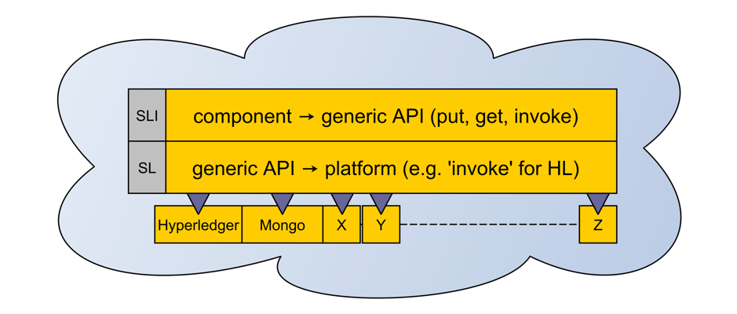
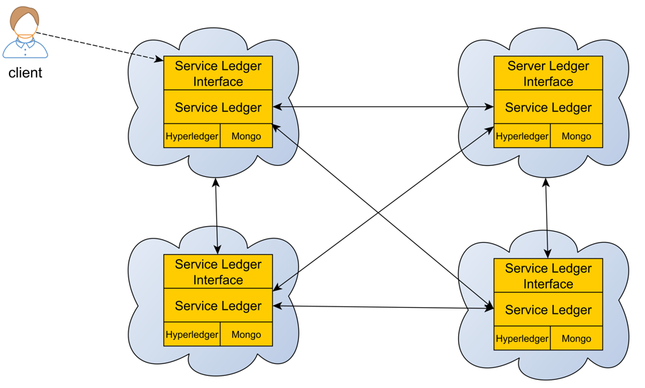
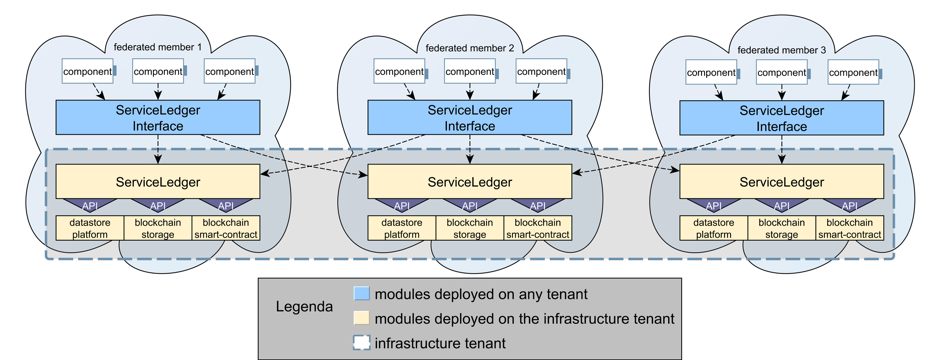

.. _sl-label:

####################
Service Ledger (SL)
####################

The main rationale behind the architecture of the Service Ledger is **flexibility, modularity** and **interoperability**. 

*Service Ledger* offers to the SUNFISH platform components straightforward interaction with complex computing infrastructure, such as **blockchain smart contract**, alleviating any technicality burdens of setting up proper communication and invocation mechanisms. 

* It features a modular architecture with respect to the tenant organisation fostered by FaaS (i.e., infrastructural, operational and segregated) to ease its deployment according to the needs. 

* It empowers the FaaS governance with democratic and distributed features by transparently integrating blockchain with all FaaS activities so to inject distinguishing characteristics like **democratic control of data computation** and **data integrity throughout the federation**. 

Service Ledger has also been designed to be pluggable: any new technology can be easily integrated without changing any high-level interaction with platform components. This crucially enhances the **sustainability over time of the SUNFISH Cloud federation solution** and, most of all, of one of its key contributions: underpinning federation with blockchain-empowered storage and computation. 

Architecture
=============

The infrastructure of the Service Ledger is composed by three main logical subsystems:

*	*Computing/Storage Platform*: the low-level blockchain (or other solution) platform used to carry out decentralised computation/storage;
*	*Service Ledger*: low-level API offering a common interface of the underlying platform;
*	*Service Ledger Interface*: component-level API acting as point of contact for the platform components. 

Logically, we have then the following setting 

hence with a two layers of API to transparently interact with the underlying platform. For the FaaS deployment, we developed full integration with two underlying platforms: MongoDB (used for testing and integration purposes) and the smart contract blockchain platform Hyperledger Fabric. 

Moving to a distributed deployment of the components, the scenario is as follows

Specifically to a FaaS federation, the high-level architecture of the Service Ledger deployment boils down to the following scenario

The *infrastructure tenant*, created across all the member clouds, features one or more SL instances (yellow blocks below) to connect with different underlying platforms; we consider three potential platforms: a data-store, a block-chain and a smart contract enabled blockchain. It comes without saying that in case of distributed infrastructure, say blockchain, such infrastructure has to be the same. The SL can be invoked by an instance of the SLI (the blue blocks below) from any tenant, that in turn can be invoked by any component. 

Computing Platform
*******************

The Computing/Storage Platform is the low-level underlying infrastructure to execute computations and store/retrieve values. It is assumed to be distributed on each federation member composing the infrastructure tenant and it can be implemented either with just a data-store or a blockchain system. 

Computations in a decentralised fashion are anyway possible only by employing a **smart contract enabled blockchain**. A data-store or a pure blockchain platform (aka à la Bitcoin) can instead just store values.

Service Ledger
***************

The Service Ledger (SL) is a distributed stateless REST API server operating as logical interface of the Computing/Storage Platform. As the underlying computing/storage platform, it is deployed on each federation member of the infrastructure tenant. The Service Ledger enables the communication with the Computing/Storage Platform.

It exposes three main operations:

*	*get(k)*
*	*put(k,v)*
*	*invoke(args)*

The operations get(k) and post(k,v) can be used with both a data-store and a blockchain as long as the memory model is based on a key-value store (KVS). Thus, NoSQL-like data-store can be employed as well as most common blockchain as they directly rely on a KVS (with versioning). The input parameters are a key `k` and an associated value `v`. **The get(k) operation returns the associated value v, while the put(k,v) returns confirmation of an insert of the pair key k and value v.**

In case of smart contract-based blockchain as underlying platform, the **invoke(args) operation can be used to invoke a computation on a smart contract and store the results on the blockchain.**

Service Ledger Interface
*************************

The Service Ledger Interface (SLI) is a stateless web app used as entry point to issue computations towards the SL outside the infrastructure tenant. Each component of the federation runs an instance of the SLI which as many operations as deployed services (or smart contract) running on the underlying Computation/Storage Platform. The SLI converts the received input in a couple key-value or in an 'args' format and, consequently, invokes the corresponding API of the SL. 

.. note::

	By splitting the overall Federated Service Ledger in the just presented three modules permits:

	* increasing flexibility, as multiple underlying infrastructure can be easily plugged-in: they just need to implement the three API put, get and invoke;

	*	increasing modularity, as interaction between components and the low-level infrastructure occurs via two levels of API

	Therefore, platform components, being within or outside the infrastructure tenant, can access all Service Ledger service via the exposed API considering the underlying infrastructure as a black box. Moreover, being multiple SLI/SL acting as entry points for the platform, the availability of the platform itself is strengthen. 

The Service Ledger infrastructure offers computational means not just for the federation governance, but also to empower cross-Cloud services. In fact, via a high-level SLI API the SL API invoke can be used to move part of the computation on, e.g., a blockchain smart contract. This gives the benefit of decentralised, immutable and non-repudiable computation. By way of example, if two member clouds need to share a decentralised computation they can use an application-oriented smart contract deployed on the blockchain via such high-level API. This is indeed the case of UC1 where part of the computation is moved to blockchain. 

