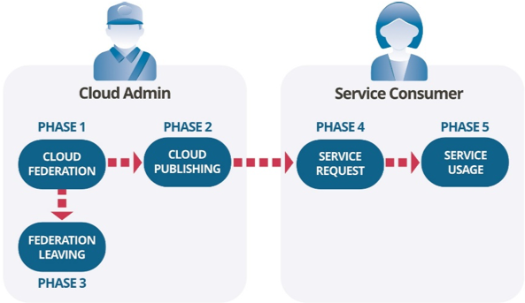
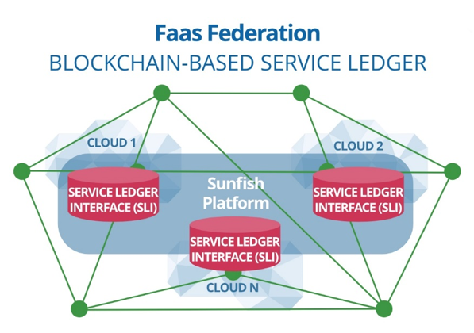
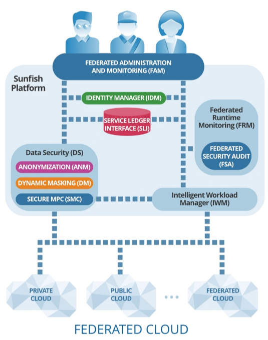

########################
The SUNFISH Approach
########################

This page outline the overall SUNFISH's approach to Cloud Computing solution for the Public Sector. 

=========================
Federation-as-a-Service
=========================

The SUNFISH project coined **Federation-as-a-Service (FaaS)** a secure-by-design Cloud federation solution that enables public sector organisations to federate their clouds in a distributed and democratic manner, thanks to an underlying blockchain infrastructure. 

FaaS creates a **homogenous goal-oriented aggregation of cloud systems**, which allows sharing of data and services. All participating nodes are peers: they enjoy the same duties and authorities. 

The corner store of FaaS is its **democratic and decentralised federation governance**. Generally speaking, it offers the these key features:

-	**Dynamic Federation of Clouds** and their services with service level agreement policy and optimal workload strategies;
-	**Cloud Federation Governance** supporting trust-less coalitions where participating clouds are governed by a federation contract agreed with a distributed consensus; 
-	**Privacy-Preserving Services** enforcing an advanced and innovative access control and monitoring.

.. note:: 
	**Blockchain technology** 
	
	It has appeared on the market in recent years, firstly used as public ledger for the Bitcoin cryptocurrency. It mainly consists of consecutive chained blocks containing records that are replicated and stored by nodes of a peer-2-peer network. The records witness transactions occurred between the nodes of the network. Transactions may feature a cryptocurrency like, e.g., the Bitcoin, or other kinds of assets. The collection of transactions and their enclosing in chain blocks is carried out in a decentralised fashion by distinguished nodes of the network, called miners. 

	Besides cryptocurrency, blockchain offers so-called **smart contract**, immutable program deployed and executed autonomously upon a blockchain.

FaaS uses blockchain technology to offer a decentralised computation infrastructure at hand that alleviates the need for a trusted-third-party and reduces systemic risk of disputes and frauds.

===============
Service Ledger
===============

The Service Ledger is a blockchain-empowered software layer which **underpins the whole FaaS federation** offering a decentralised (hence without any centralised point-of-failure) platform upon which basing highly trusted services such as the *governance of the federation* or *cross-cloud piece of computation*. 

On the fact of it, FaaS and the SUFISH platform appear to be the **first blockchain-based cloud federation architecture of its denomination**. 

====================
The SUNFISH Platform
====================

The SUNFISH Platform is a modular software solution that enables the dynamic and secure creation of cloud federations and their management.

Its main features are: 

-	**Dynamic cloud federation management**. A dynamic federation of clouds and their related services, with optimal service level and workload; the service offered is based on "core components" (IDM, DS, FAM, IWM) that are necessary to assure the creation and essential federation management. 

-	**Democratic governance**. An innovative cloud federation governance supporting trust-less coalitions, as none of the federated organizations rules on the others, thanks to the "Service Ledger" which - based on the blockchain technology - offers decentralised and democratic enforcement of governance rules in the federation. Such governance is then ruled according to a federation contract negotiated among partners. 

-	**Data security**. Advanced, innovative privacy-preserving services ensuring high security of provisioned services and managed data. The backbone of data security is a distributed access control infrastructure transparently enforcing cross-cloud access policies and privacy-preserving services. Data masking (DM) ensures that sensitive data can be securely stored protecting sensitive data of interest. Data anonymisation (ANM) ensures that datasets can be released (both in a micro and macro fashion) without leaking sensitive data. Secure multi-parties computation (SMC) offers privacy-preserving computation of sensitive data: any of the party involved in a computation can learn anything on the data itself. 

-	**Brokerage of Federated services**. Services of single clouds can be dynamically federated and brokered according to security and Service Level Agreement (SLA) policy. Due to an intermediate layer of API, any type of service, ranging from infrastructure to software and data, can be federated and provided. 

-	**Federation Monitoring**. Cross-cloud integrations and distributed nature of federations require advanced monitoring facilities that can ensure the integrity and correctness of the provisioned services. FRM and FSA offer runtime and offline monitoring respectively to protect from security violations such illegitimate accesses and privilege escalations. 

This set of functionalities is implemented via state-of-the-art technology and take advantage of the blockchain infrastructure underlying SUNFISH federations to strengthen security assurance of provisioned services and security controls. 

