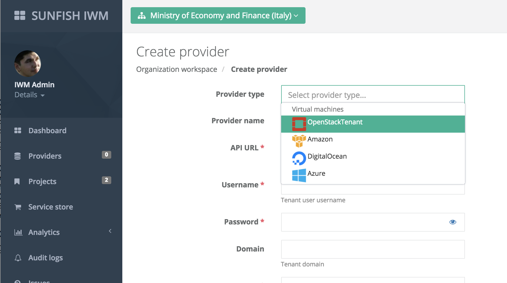
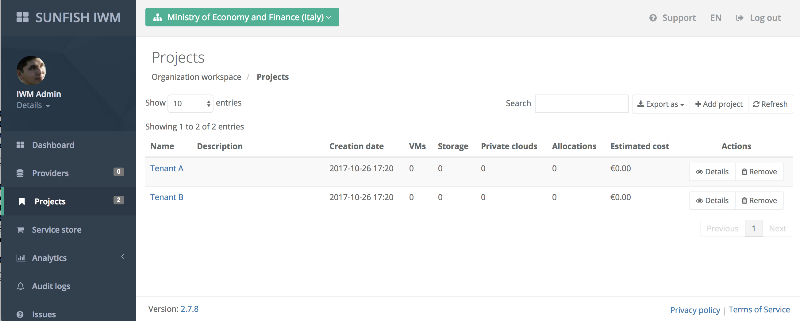
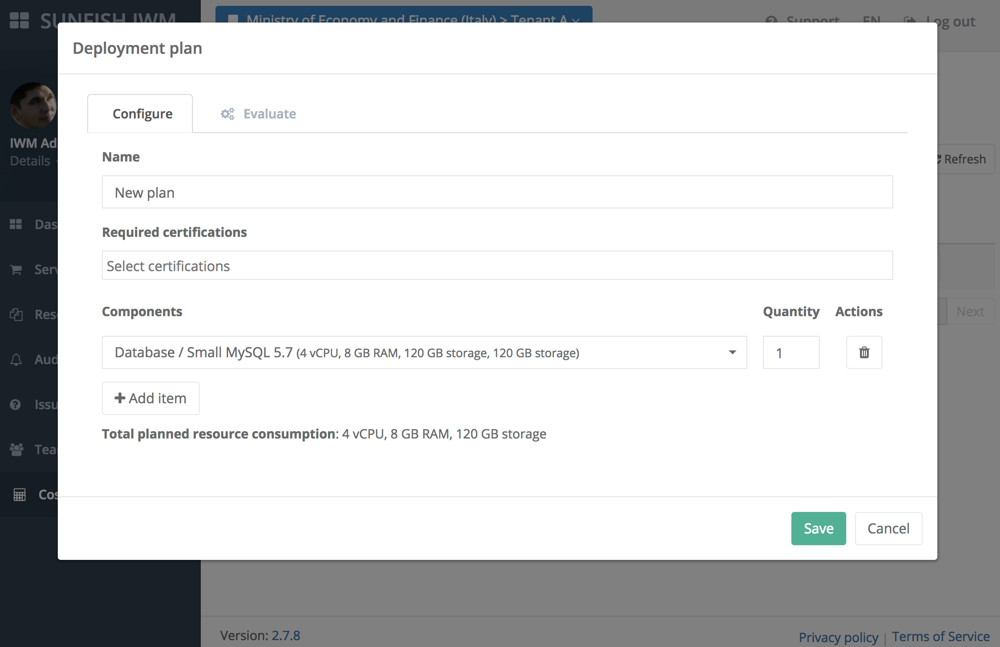
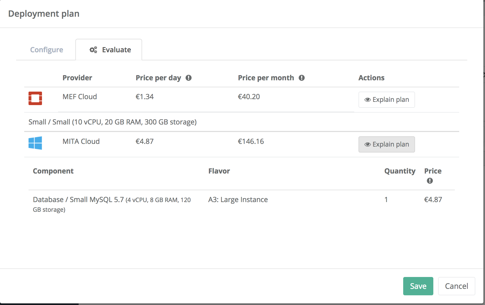

###################################
Intelligent Workload Manager (IWM)
###################################

Deployment instruction
=======================

IWM functionality has been integrated into Waldur. As such, deployment of IWM is done in the same
fashion as upstream. Installation script is below. Deployment requirements are:

- CentOS 7 or other RHEL7-compliant operating system
- At least 8GB of RAM, preferably 2 cores or more.

.. code-block:: bash

    yum clean all
    yum -y update

    # Configure repositories
    yum -y install epel-release
    yum -y install https://download.postgresql.org/pub/repos/yum/9.5/redhat/rhel-7-x86_64/pgdg-centos95-9.5-2.noarch.rpm
    yum -y install https://opennodecloud.com/centos/7/elastic-release.rpm
    yum -y install https://opennodecloud.com/centos/7/waldur-release.rpm

    # Set up PostgreSQL
    yum -y install postgresql95-server
    /usr/pgsql-9.5/bin/postgresql95-setup initdb
    systemctl start postgresql-9.5
    systemctl enable postgresql-9.5

    su - postgres -c "/usr/pgsql-9.5/bin/createdb -EUTF8 waldur"
    su - postgres -c "/usr/pgsql-9.5/bin/createuser waldur"

    # Set up Redis
    yum -y install redis
    systemctl start redis
    systemctl enable redis

    # Set up Elasticsearch
    yum -y install elasticsearch java

    systemctl start elasticsearch
    systemctl enable elasticsearch

    # Set up Logstash
    yum -y install logstash

    cat > /etc/logstash/conf.d/waldur-events.json <<EOF
    input {
      tcp {
        codec => json
        port => 5959
        type => "waldur-event"
      }
    }

    filter {
      if [type] == "waldur-event" {
        json {
          source => "message"
        }

        mutate {
          remove_field => [ "class", "file", "logger_name", "method", "path", "priority", "thread" ]
        }

        grok {
          match => { "host" => "%{IPORHOST:host}:%{POSINT}" }
          overwrite => [ "host" ]
        }
      }
    }

    output {
      elasticsearch { }
    }
    EOF

    systemctl start logstash
    systemctl enable logstash

    # Set up Waldur Core
    yum -y install waldur-core

    su - waldur -c "waldur migrate --noinput"

    systemctl start waldur-uwsgi
    systemctl enable waldur-uwsgi

    systemctl start waldur-celery
    systemctl enable waldur-celery

    systemctl start waldur-celerybeat
    systemctl enable waldur-celerybeat

    su - waldur -c "waldur createstaffuser -u admin -p admin"

    # Set up Waldur MasterMind
    yum -y install centos-release-openstack-pike
    yum -y install waldur-mastermind

    su - waldur -c "waldur migrate --noinput"

    systemctl restart waldur-uwsgi
    systemctl restart waldur-celery
    systemctl restart waldur-celerybeat

    # Set up Waldur HomePort
    yum -y install waldur-homeport

    # Set up Nginx
    yum -y install nginx

    systemctl start nginx
    systemctl enable nginx

Screenshots
============

Screenshots below are taken from a demo deployment of IWM in a federation.

  Login view of IWM frontend, white-labelled to a concrete federation.

  Adding federation service providers to IWM.

  Listing registered SUNFISH tenants within an IWM.

  Visual interface to optimisation API for finding the best option for a planned infrastructure.

  Results of the optimisation with 2 service providers in the federation.

