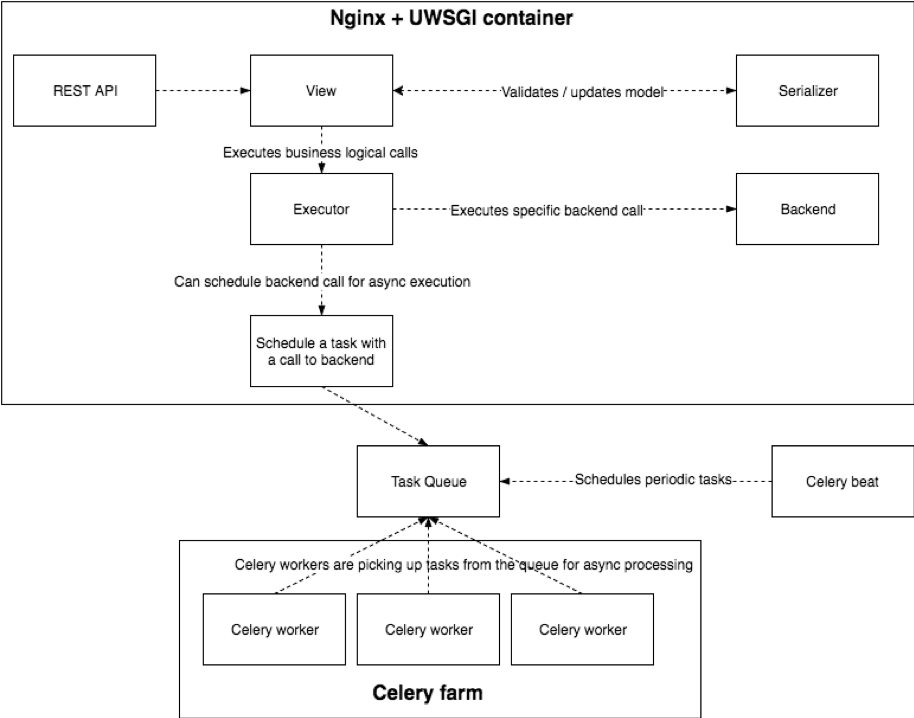

###################################
Intelligent Workload Manager (IWM)
###################################

SUNFISH Federation provides automated services for joining and leaving the federation, as well as
an interface to the available Federation services for a Service Consumer with ability to request
optimised service list of services matching Consumer requirements better. A common aspect of all
use cases is requirement to be able to retrieve information about the Federation resources and
optionally schedule execution of a workload on a particular service provider. Within SUNFISH, a
component responsible for delivering such functionality is called **Intelligent Workload Manager**
(IWM).

Optimisation model applicable to the scenario of Service provisioning by Service Consumer is
offering an improvement over local scheduling while imposing as little as possible of additional
overhead on the definition of the workload requirements. Improvement means achieving a better
outcome regarding user-defined parameters (e.g. cost) while preserving the strict
requirements for the job payload. The goal of the model is to offer an added value over local scope
of resources by finding and managing a globally optimal target for the Service Consumer’s planned
workload.

Optimisation model is a logical component exposed to the user in form of an optional ordering and
filtering capability used during provider lookup request.

IWM is based on open-source `Waldur <https://opennodecloud.com/products/waldur.html>`_ cloud brokerage platform. The latter is extended to include more fine-grained optimisation capability. The functionality developed within SUNFISH has been integrated
with the upstream.

Technically, IWM is composed of the following primary components as from the figure below

*	Nginx and uwsgi container hosting IWM - exposing API over HTTPS.
*	Task Queue (Redis) for storing asynchronous tasks.
*	Celery worker pool - processors of the stored tasks.
*	Celery beat - a process for scheduling regular tasks (similar to Cron on Linux).

Azure Integration
==================

IWM supports provisioning and management of compute resources on private and public clouds. Within SUNFISH, Azure support has been added to IWM for management of the Azure Classic VMs. The pricing and configuration of VM types has been integrated with the optimizer component to allow simplified comparison and finding optimal match also with Azure, if federation has a registered account.