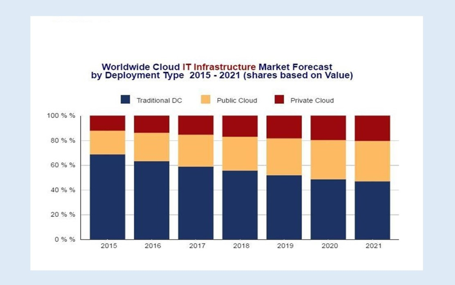

######################################
Cloud Computing and the Public Sector
######################################

Cloud computing is drawing wide attention in the *Public Sector*. Nowadays main bodies rely on their own private clouds, leading to a multitude of secluded, not-interoperable cloud centres. The lack of reliable cross-cloud infrastructure hinders effective and practicable exploitation of clouds in the Public sector. 

The *SUNFISH Project* has built upon this need by providing *a software platform that via the principled usage of a blockchain infrastructure offers decentralised, democratic and secure federation of private clouds*.

===================================================
Adoption of Cloud Computing: report and challenges
===================================================

Cloud computing has been part of the computing landscape for more than 10 years and it is lately increasing its deployment within businesses and individual costumers. It provides substantial benefits in particular by offering: 

i) **economic growth** by providing an IT environment where technology is located in the most efficient way; 

ii) **more choice and lower cost**, increasing competition among providers. 

While in a rapidly evolving environment, cloud services are one of the cheapest means to secure a large part of e-Government services. Cloud computing overcomes barriers typical to the public sector by improving features of effectiveness, efficiency, transparency, participation, data sharing, cooperation, interoperability and security. **Cloud computing solutions are now among the most innovative tools** and their adoption within European public sector organisations would allow them to take thrilling advantages from their adoption. 

The interest in adoption of cloud computing solutions also for delivering Public Administration services has been emerging as a key target in the design of next generation public services. This process requires the selection of the most suitable solutions in order to fill into the current public sector technological gap, and to be able to face the challenges of the "EU Digital Market" for the next years. Cloud computing is surely a key enabling technology in order to improve efficiency and cost effectiveness while deploying new public services. 

Cloud infrastructure is capable of introducing in the public sector mechanisms fulfilling citizens' demands and it is particularly interesting when applied to support the provision of governmental applications provided to citizens by public authorities. 

The European Commission study - *"Measuring the economic impact of cloud computing in Europe, 2016"* - estimated that in the period 2016-2020, cloud computing could add a cumulative total revenue of EUR 449 billion to the EU28 GDP (including in the Public Sector). Of these EUR 103,2 billion would be net new GPD generated in the year 2020, representing a share of 0,71% of total EU GDP.

According to this study, the **cumulative impact on employment is expected to reach 1,6 million jobs created up to 2020** (ranging from 2,5 million according to the optimistic scenario and slightly over 1 million in the pessimistic scenario). In terms of business creation, approximately 303.000 new businesses, in particular SMEs, could be created between 2015 and 2020 through the development and deployment of cloud computing.

According to IDC's Worldwide Quarterly Cloud IT Infrastructure (2016), traditional datacenters in 2017 weigh nearly 60% of IT infrastructure, while the remaining 40% are on clouds (with about 25% of public clouds). In 2021, the situation will reverse: traditional data centers will weigh about 45%, while the cloud for nearly 55%, of which about 35% will be public cloud while 20% private. However, according to Gartner (2016) by 2020 hybrid cloud will be the most common use of the cloud. 

Clear examples of how governments are embracing this strategy are provided by the EU Regulation 2016/679, with the European Cloud Strategy, and national strategies and plans such as 

i) the Italian AGID's `three-year Plan <http://pianotriennale-ict.readthedocs.io/en/latest/doc/01_piano-triennale-per-informatica-nella-pa.html>`_ for 2017-2019 and the `Cloudify program of NoiPA <https://www.cloudifynoipa.it/documents/20143/0/Allegato+Agenda+Digitale+Italiana_EN.pdf/75734d80-6e98-0561-4d3c-d023d71a477f>`_;

ii) the British government's cloud computing plan (`G-cloud <https://www.gov.uk/guidance/the-g-cloud-framework-on-the-digital-marketplace>_`); 

iii) the French `Guide sur le Cloud Computing et les Datacenters à l'attention des collectivités locales <https://www.entreprises.gouv.fr/files/files/directions_services/secteurs-professionnels/numerique/guide-cloud-computing-et-datacenters-2015.pdf>`_; 

iv) the Spanish `Líneas estratégicas del plan de Administración Electrónica del Gobierno <https://www.ccn-cert.cni.es/seguridad-al-dia/noticias-seguridad/554-lineas-estrategicas-del-plan-de-administracion-electronica-del-gobierno-2013-2015.html>`_. 

***********
Challenges
***********

However, the migration process is not always a smooth procedure given several issues can emerge when the transition towards Cloud solutions is applied to the Public Sector. Main concerns in the adoption process for public organisations are the following: 

-	governance and control of ICT systems also across different Public Administration bodies; 
-	application of the concept of Quality of Experience (QoE) also to cloud services; 
-	ownership and asset liability; 
-	security, privacy and trustworthiness;
-	resilience of infrastructures and services; 
-	interoperability and standards; 
-	dependencies with vendors; 
-	National and Supranational regulation.  

The migration process towards Cloud solutions consists mainly of four pillars: 

1.	selection of applications/services that have to be migrated; 
2.	technical and process challenges; 
3.	backward compatibility with legacy applications; 
4.	operational cloud setup.

Given such a revolutionary context characterising new public services delivered via digital means, the SUNFISH project consortium partners have been contributing to this challenge by focusing on cloud development for the public sector.  

===============================
Benefits for the Public Sector
===============================

According to up-to-date studies, the main common benefits of the adoption of Cloud computing solutions for a public sector organisation are:

1.	**Cost effectiveness**: the use of Cloud computing solutions do not have all the maintenance costs that physical data centres do have. Especially in the public sector there is the need to rationalize public expenses and cost savings are a significant key factor;

2.	**Sustainability & Green saving**: most data centres are environmentally and economically unsustainable due to their scares energy consumption efficiency. The adoption of Cloud computing solutions, would allow on one hand to cut CO2 emissions, through a reduction of hardware use, and energy consumption thanks to the use of more efficient cooling systems; on the other hand public sector organisations would be able to pay the Cloud solution less than a data centre one, as there is a huge saving in energy consumption even for the providers.

3.	**Ease of Implementation**: public sector organisations can deploy cloud computing rapidly as there is no need to purchase hardware, software licenses, or implementation services;

4. **Flexibility**: cloud computing solutions offer more in matching ICT resources to business functions than past computing methods. It can also increase staff mobility by enabling access to business information and applications from a wider range of locations and devices, enabling public sector employees to easily access data even if they are out of office through any kind of device;

5. **Innovation**: innovation represents a deep need of public sector organisations, as most of the time they lack innovation processes. Once the Cloud is adopted, its architecture would facilitate services across systems and organisational borders, such as the exchange of data among different administrations of the same public sector organisation;

6. **Scalability**: public sector organisations adopting cloud computing solutions don't need to procure any additional hardware and software when users' loads are increasing, but can instead simply add and subtract capacity to the Cloud when and if needed. In this way, resources are used only when needed;

7.	**Redeployment of IT personnel due to Cloud efficiency**: by reducing or eliminating constant server updates and other computing issues, and consequentially cutting expenditures of time and money, public sector organisations can relocate ICT personnel on higher-value tasks;

8. **Focusing on Core Competencies**: the ability to run data centres and to develop and manage software applications is not necessarily a core competency of most public sector organisations. Indeed, the adoption of Cloud computing solutions can make it much easier to reduce these functions, enabling public sector organisations to concentrate on critical issues such as the development of policy and the delivery of public services;
