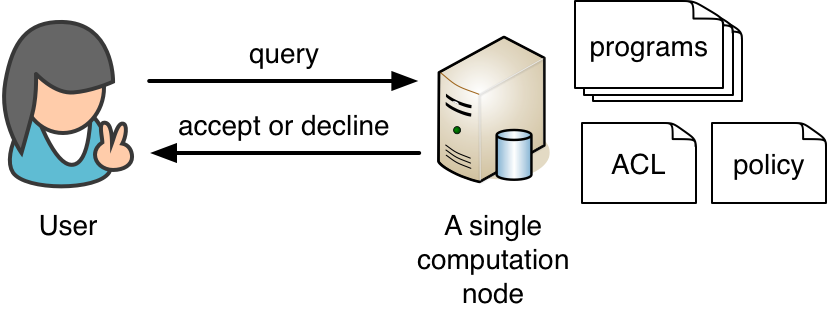

=============
Sharemind MPC
=============

Theoretical Background
----------------------

Sharemind MPC is a practical implementation of secure multi-party computation technology with the emphasis on performance and ease of use. Sharemind MPC supports several different SMC schemes called *protection domains*, but the SUNFISH platform uses the *shared3p* protection domain, which stands for 3-out-of-3 secret sharing with passive security. This protection domain uses additive secret sharing scheme, where a secret value :math:`s` is secret shared as follows:

.. math::
   s_1 &\leftarrow \mathrm{random()},\\
   s_2 &\leftarrow \mathrm{random()},\\
   s_3 &\leftarrow s - s_1 - s_2,

such that :math:`s = s_1 + s_2 + s_3`. All these computations are done modulo the corresponding data type size, e.g. modulo :math:`2^{64}` for 64-bit (unsigned) integers. Note that this modulo computation happens automatically for primitive data types like ``(u)int8``, ``(u)int16``, ``(u)int32`` and ``(u)int64``. More complex data types (e.g. floating point numbers) use structures of primitive data types.

Architecture
------------

Sharemind MPC deployment consists of two types of components -- application servers and client applications. 
Sharemind Application Server implements the SMC computation node role, it talks to other Application Servers during SMC protocols and to client applications for user input and output. It also has a local persistent storage for saving input shares and computation results between computations.
A typical Sharemind MPC deployment supporting the *shared3p* protection domain has three application servers and any number of client applications.

On Sharemind MPC platform, privacy-preserving applications are developed using the open source SecreC programming language. SecreC is a domain specific language that separates private and public data flows. By marking user (and other sensitive) input as private, an application developer can be confident that all computations involving these values are executed in the secure SMC environment. At the same time, the developer does not have to know the underlying SMC protocol details.

An example SecreC program, counting the number of occurrences of a secret value in a vector of secret values:

.. code-block:: c++

   import shared3p;
   import stdlib;

   // All variables prefixed with `pd_shared3p` are secret-shared
   domain pd_shared3p shared3p;

   void main() {
      pd_shared3p uint64[[1]] haystack = {1, 2, 3, 4, 5, 6, 7, 8, 9, 10};
      // In reality, this comes from database:
      // pd_shared3p uint64[[1]] haystack = loadFromDB(...);
      pd_shared3p uint64 needle = 5;
      // In reality, this comes from user-supplied argument, for example:
      // pd_shared3p uint64 needle = argument("needle");

      // Because of private operands, the equality operation
      // invokes a corresponding SMC protocol
      pd_shared3p bool[[1]] match = (needle == haystack);

      // Publish orders each computation node to send its 
      // corresponding share back to the client application
      publish("count", sum(match));
   }

SecreC programs are deployed on Application Servers and invoked by authorised client applications by their name (think of remote procedure calls or stored procedures in database management systems). This happens in parallel in all three Application Servers.

   In Sharemind MPC, each Application Server is independent in validating the user query against its access control list (ACL) and the data usage policy.

It is important to notice that each Application Server is independent in deciding
a) whether the user is authorised to run a given SecreC program; and
b) if the requested SecreC program correctly implements the data usage policy.
An SMC protocol cannot be executed if the Application Servers do not reach consensus in these questions. Consequently, a user can only run a predetermined set of programs and a single server or a pair of servers cannot allow potentially malicious queries without the consent of the third server.
This provides cryptographic enforcement of data usage policies.

Requirements and Privacy Guarantees
-----------------------------------

Deploying Sharemind MPC in practice requires that the three Application Servers (computation nodes) are hosted by independent parties who do not collude. Good candidates are government organisations form different jurisdictions or peers that are themselves interested in the correct outcome of the computation.

With the non-collusion requirement holding, secure multi-party computation technology and Sharemind MPC guarantee the confidentiality of private values, except the ones that are explicitly published by all three servers (either to the user or the servers themselves). 