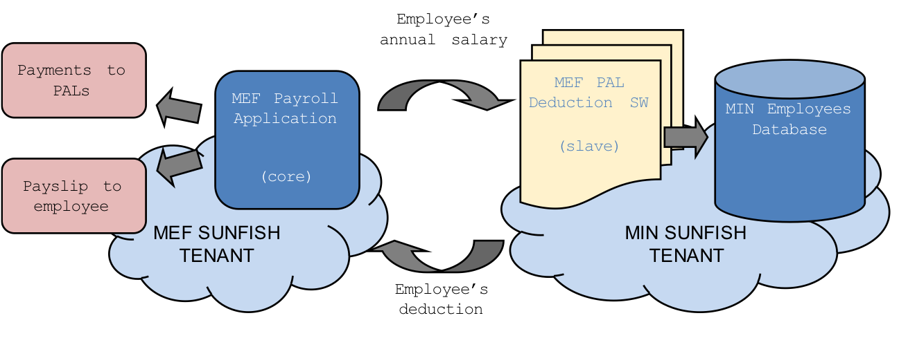
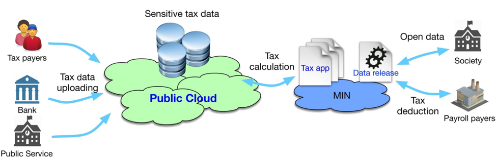
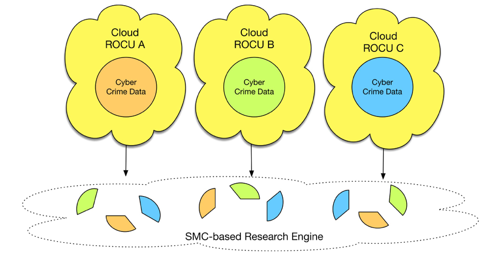

###########
Use Cases
###########

This is a page for the SUNFISH use cases, reporting the business rationale behind the use case. 

================================
Cross-cloud payslip calculation
================================

The General Administration, Personnel and Services Department (DAG) of the Italian Ministry of Economy and Finance (MEF) is in charge of the management of payroll functions for approximately 2.1 million Italian public sector employees. Such service is provided through a unique payroll function, NoiPA - which currently manages annually more than €51 billion in payments. Starting in 2015, the compulsory entrance in NoiPA of Italian police and military personnel generated an increase of around 25% of the monthly payslips managed by the system. 

The Italian legal framework forces the Ministry of Interior (MIN), in charge of Police Forces, to be the exclusive controller of sensitive data of its employees. The main problem generated by the entrance in NoiPA of MIN's employees was overcoming segregation of Public Bodies data among Clouds for calculating payslips. 

In particular, the MEF must compute local taxes on actual residence, which is however sealed for data classification purposes within the MIN. The MEF and the MIN had therefore to balance two contrasting needs: on one side, the MEF's need to have certified computation of sensitive data, on the other side the MIN's need to keep sensitive data within its perimeter. This created a problem for the overall calculation of taxes and to overcome it the MEF and the MIN were forced to an intricate cooperation keeping low level of efficiency and elevated costs. 

The potential conundrum was overcome via a Federation-as-a-Service platform and its blockchain-empowered Service Ledger infrastructure. This system, put in place by SUNFISH, allows the democratic governance of cloud federations: none of the federated clouds rules on the other, but each of them shares the same duty and authority

=============================================================
Private-Public Cloud integration to underpin tax calculation
=============================================================

The Maltese Ministry for Finance has been leading the innovation of the Country's Public Sector with the goal of easing citizens' interaction with the Government. This has been achieved by adopting a once-only principle and by facilitating the re-use of public data. Pushed by the growing awareness of central public administrations' need to promote a different role across Europe, the Ministry's interest for innovation led it to look for proposals in the field of cloud computing for the public sector.

Such kind of development is a great opportunity in particular within the Taxation Department, which requires taxpayers, employers, banks and SMEs, to submit information to the Office of the Commissioner for Revenue. This information relates to Payroll, Financial Statements, information related to payments that qualify for deduction from chargeable income, and receipts of payments that need to be included in taxable income, trading records and accounting records that maybe subject to audit checks.

Large enterprises can lean on their financial capability to submit payroll data and financial statements via the Department's website and await for the end of the year to receive their tax deduction back. Small businesses, on the other hand, might struggle because of their financial means. 

Where applicable, the Department requires data from Employers and other third parties for the calculation of tax statements and eventual issuance of refunds. To provide a holistic solution, the Department can make use of public cloud services to host Software-as-a-Service (SaaS) solutions and to federate these with its own private cloud. 

This use case enables the use of public cloud Platform-as-a-Service (PaaS) offerings to deploy applications which collect data and perform required calculations and validations while ensuring compliance with the secrecy, privacy and data protection legislations and regulations. It also allows for the use of federated systems between the MFIN application on the public cloud PaaS and other commercial SaaS solutions providing services such as payroll etc. 

================================
Secure cross-cloud data sharing
================================

South East Regional Cyber Crime Unit (SEROCU) is one of the nine Regional Cyber Crime Unit (ROCU) operating across the UK. Besides its regional role, it collaborates on a national level with major crime units, all ROCUs and the National Cyber Crime Unit, to prosecute offenders based in Europe and beyond.

SEROCU is responsible for the investigation of offences categorised under the Misuse of Computer's Act 1990 and other offences where a digital aspect is believed to be involved. Its powers include the seizure and forensic examination of digital data and electronic devices, as well as live network investigations. Part of SEROCU's mandate is to store securely large quantities of cyber-crime evidences and highly sensitive data, such as: high-level corporate information, data produced from network servers and personal digital storage devices. Its investigations generate evidences with different security classifications, each of which, depending on Governmental guidance, comes with its own strict handling conditions. 

The storage of such data must be localised on the Unit's premises but at the same time, each unit must ensure access, in a regulated manner and with different levels of accessibility, to all other ROCUs while investigations are in process. The sharing of such information among ROCUs not only encountered difficulties brought about the different interfaces implemented, but it was convoluted and hardly automated. Moreover, due to changing reporting procedures around cyber-crime issues, it is impossible to predict with certainty the future demand for the unit and, therefore, data capacity and processing requirements. There is a current need to ensure the efficient and secure reception, supply, and storage of intelligence/data between the regional units, local policing forces, and governmental departments.

Clouds have the ability to help overcoming concealed ROCUs data storage systems by fostering cross-Cloud regulated sharing of information. This would allow reaping the cost, usability and connectivity benefits of the cloud, whilst sharing the infrastructure safely and reliably between many different Government and Policing agencies.

