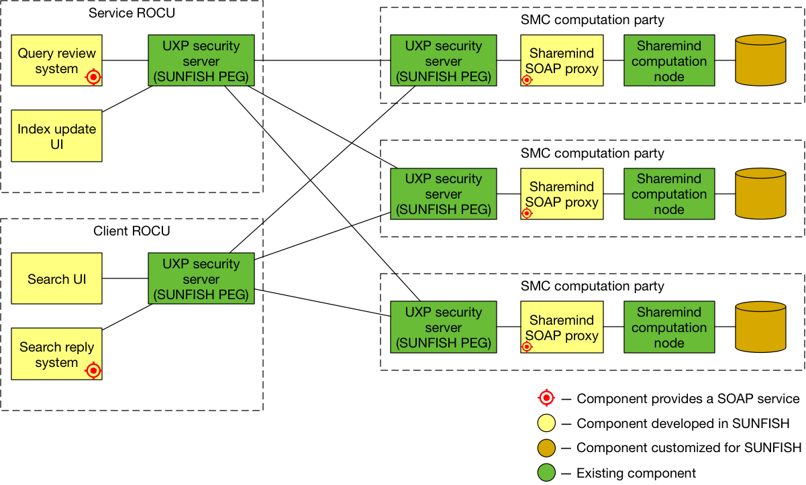

===============================================
UC-3: Federation-based Intelligent Shared Index
===============================================

We refer to online videos on 

`High-level <https://www.youtube.com/watch?v=RLIkbUG2imc&t=61s>`_ video on the use case

`Here <https://www.youtube.com/channel/UCRabwDVWQEaQxSoAXbA-BBQ>`_ how the SUNFISH solution at work to realise the service

Deployment Instructions
=======================

   SMC Architecture of the Intelligent Shared Index.

Index Service
-------------

SMC nodes together provide the shared intelligence index service. The following steps have to be completed on each SMC node. At each SMC node, the Sharemind Application Server is accompanied by a proxy application that implements a SOAP interface so the communication can be routed through the Unified eXchange Platform (UXP).

First, install and configure Sharemind Application Server as described in `Instructions for Deploying SMC <../smc/deployment.html>`_. The SOAP proxy also requires a special version of Sharemind Web Application Proxy that uses SOAP for its transport layer.

Clone and run the SOAP proxy:

.. code:: bash

	git clone https://github.com/sunfish-prj/Secure-Multiparty-Computation
	cd Secure-Multiparty-Computation/usecase/index-service

	# Install NodeJS dependencies
	npm install

	# Compile SecreC code
	scc -o /var/lib/sharemind/scripts/add-document.sb secrec/add-document.sc
	scc -o /var/lib/sharemind/scripts/add-owners.sb secrec/add-owners.sc
	scc -o /var/lib/sharemind/scripts/search.sb secrec/search.sc

	# Configure Sharemind Application Server names and ROCU Service addresses in gateway.js

	# Run SOAP proxy
	node gateway.js <node number> <IP> <port> <configuration file>

ROCU Service
------------

Because of the query review and oblivious notification systems, ROCU-s also act as SOAP services in addition to being SOAP clients. Node v6 or newer and ``npm`` are required to deploy ROCU Service. In addition, a a copy of Sharemind MPC JavaScript Client library is required.

Clone and run the ROCU Service:

.. code:: bash

	git clone https://github.com/sunfish-prj/Secure-Multiparty-Computation
	cd Secure-Multiparty-Computation/usecase/rocu-service

	# Point Sharemind MPC JavaScript Client library (sharemind-web-client) to a local copy in package.json

	# Install NodeJS dependencies
	npm install

	# Configure Index Service addresses in rocu-service.js

	# Run ROCU Service
	node rocu-service.js <IP> <port>
